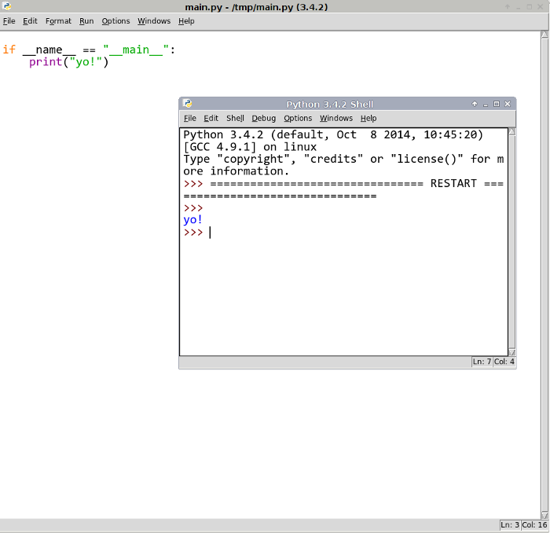

<div dir="rtl">

چگونه یک سرویس پردازشی ساده بسازیم؟
====

<div align="center">


<div align="right">

## معرفی

این یک راهنما برای طراحی و توسعه‌ی یک سرویس پردازشی با زبان پایتون است. هدف این راهنمایی کمک به یادگیری مفاهیم مربوط به توسعه‌ی سرویس‌های وب است.

## فرض‌ها
1. فرض شده است که روی ماشین شما سیستم عامل [دبیان](https://www.debian.org/) یا بچه‌های(برای مثال [اوبونتو](https://www.ubuntu.com/)) آن نصب است.
2. در صورتی که سیستم عامل شما دبیان است فرض شده است که نسخه دبیان 8 با کرنل لینوکس amd-64 روی ماشین شما نصب است.
3. در صورتی که سیستم عامل شما اوبونتو می‌باشد لطفا از نسخه 16.04 و به بعد آن با معماری amd-64 استفاده کنید.

## فهرست

1. نصب و راه اندازی Python3
2. نصب Flask و بقیه Packageهای مورد نیاز
3. ساختن Virtual Environment
4. معرفی سرویس هش رشته‌های حرفی(SimilarityFinder)
5. طراحی سرویس SimilarityFinder
6. پیاده سازی سرویس‌ SimilarityFinder
7. تست سرویس SimilarityFinder

### نصب و راه اندازی Python3

می‌توانید با اجرای دستور‌های زیر در Terminal پایتون ۳ و IDE آن بنام IDLE را نصب کنید.

<div align="left">

```Bash
sudo apt-get install -y python3-pip idle3 bpython3 python3-virtualenv
```



<div align="right">
### نصب Flask و بقیه Packageهای مورد نیاز

### ساختن Virtual Environment

### معرفی سرویس هش رشته‌های حرفی(SimilarityFinder)

### طراحی سرویس SimilarityFinder

### پیاده سازی سرویس‌ SimilarityFinder

### تست سرویس SimilarityFinder
